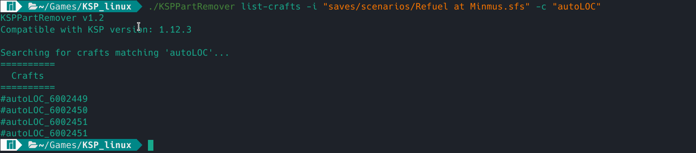
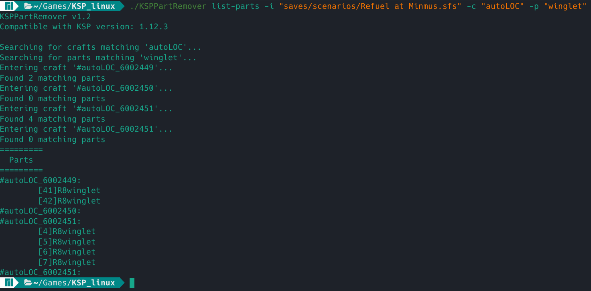
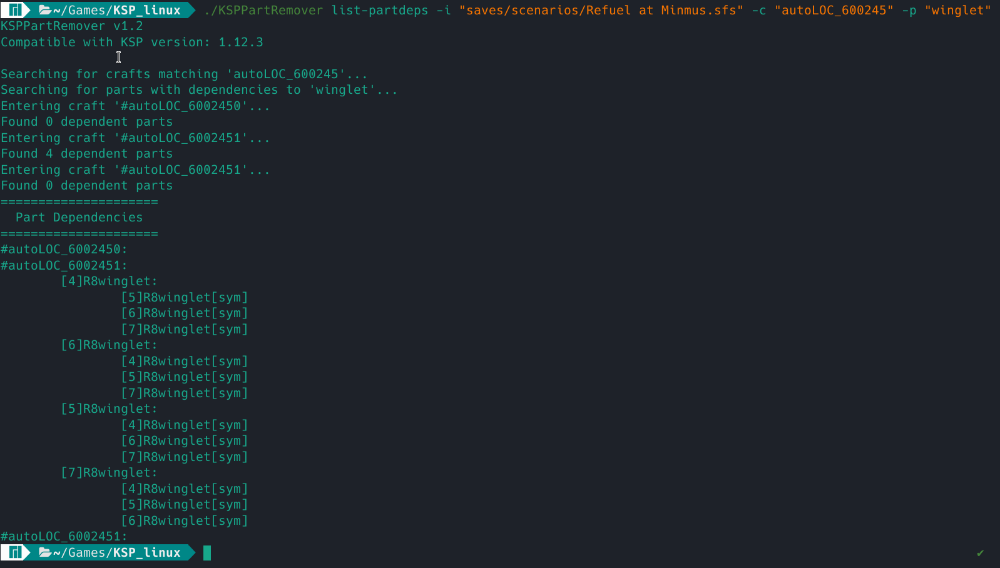
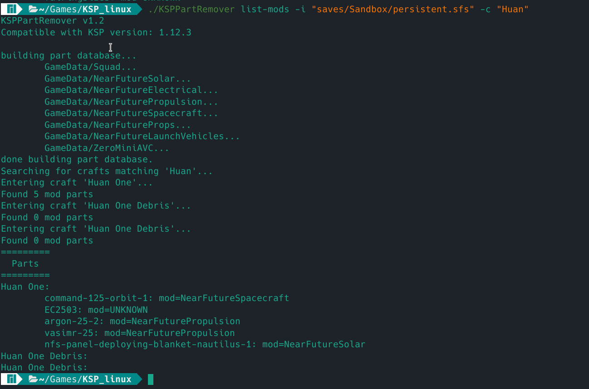
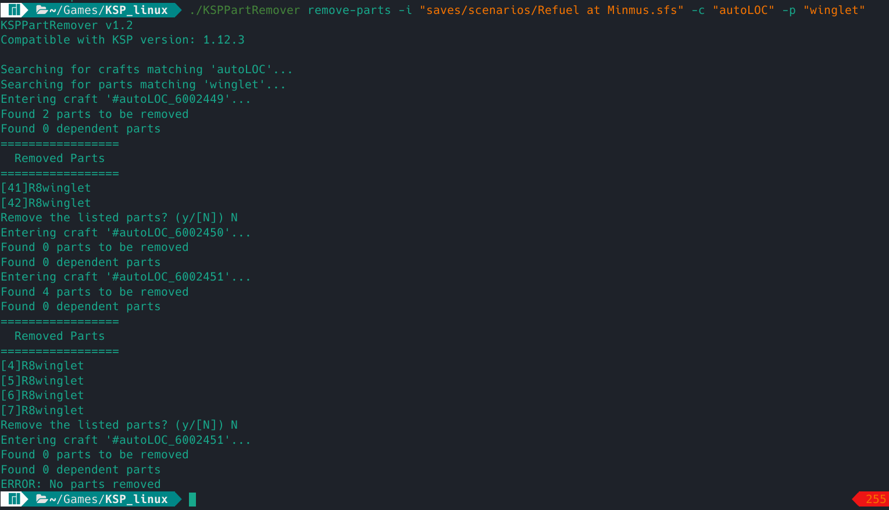

KSPPartRemover v1.2.1
=====================

Author: ChrisDeadman

Removes parts from Kerbal Space Program crafts - and more :)

## Brief feature list
* Works with craft (.craft) and savegame (.sfs) files
* Can print the list of crafts in a savegame-file
* Can print the list of parts in any craft- or savegame-file
* Can print the list of part-dependencies in any craft- or savegame-file
* Can print mods used by any craft- or savegame-file
* Can remove parts from any craft- or savegame-file
  * Checks all links to the removed part(s) and only removes dependent parts with "hard" dependencies
  * Adapts "parent", "link", "sym", "SrfN" and "AttN" links on dependent parts

## General notes

* If no output file is specified, the input file is modified.
* This tool supports a **--silent** switch and can be used programmatically should you desire.
* It has been tested with the following types of files so far :
  * .craft files generated by KSP 1.12
  * .sfs files generated by KSP 1.12
  * .txt vessel files generated by LMPServer (not fully tested)

## Usage
```
KSPPartRemover v1.2.1
Compatible with KSP version: 1.12.3

usage: KSPPartRemover <command> [<switches>] -i <input-file>

Commands:

         list-crafts
                 list crafts in the input file

         list-parts
                 list parts in the input file

         list-partdeps
                 same as 'list-parts' but also prints dependencies
                 the part filter is applied on the dependencies for this command

         list-mods
                 list mods used by the parts in the input file
                 if you don't have a required mod installed it will be listed as UNKNOWN
                 [KSP directory needs to be your current directory for this to work!]

         remove-parts
                 remove one or more parts from one or more crafts

Switches:

         -i <path>
                 specifies the input file

        [Optional]
         -o <path>
                 specifies the output file (modifies input file if not specified)

        [Optional]
         -c, --craft <name-pattern>
                 apply craft filter (applies to all crafts if not specified)
                 '!' in front of the regex performs inverse matching
                 example for name pattern: --craft '^Asteroid'
                 example for inverse matching: --craft '!Mün'

        [Optional]
         -p, --part <id or name-pattern>
                 apply part filter (applies to all parts if not specified)
                 if part is a number it is interpreted as the part id
                 '!' in front of the regex performs inverse matching
                 example for id: --part 1
                 example for name pattern: --part 'fuelTank.*'
                 example for inverse matching: --part '!^PotatoRoid$'

        [Optional]
         -s, --silent
                 do not print additional info, do not ask for confirmation
```

## Usage Examples

### list-crafts



### list-parts



### list-partdeps



### list-mods



### remove-parts



Release notes
=======================

### KSPPartRemover v1.2.1
* Command **list-mods** no longer lists squad expansion parts as UNKNOWN if expansion is installed
* Compatible with KSP version: 1.12.3

### KSPPartRemover v1.2
* New command **list-mods**: list mods used by the parts in the input file
  * If you don't have a required mod installed it will be listed as **UNKNOWN**
  * **KSP directory needs to be your current directory** for this to work!
* Make loading files much more tolerant (since part information from mods can now be loaded from KSP directory)
* Compatible with KSP version: 1.12.3

### KSPPartRemover v1.1
* Switch to .NET Core 3.1
* Compatible with KSP version: 1.12.3

### KSPPartRemover v1.0
* Minor changes to output messages
* Compatible with KSP version: 1.1.3

### KSPPartRemover v0.3
* **NOTE:** command line interface is not backwards compatible!
* Add support for .sfs files
* Add support for multiple crafts
* New command **list-crafts**: list crafts in the input file
* New command **list-parts**: list parts in the input file
* New command **list-partdeps**: same as **list-parts** but also prints dependencies
* Add craft- and part-filter support via regex (inverse matching supported)
* Dependent parts are now only removed if they have a "hard" dependency
* Reduce displayed entries per page from 50 to 20
* Fix "output file not found" error - *facepalm*
* Compatible with KSP version: 1.1

### KSPPartRemover v0.2.1.1
* preserve formatting of input file when adjusting part properties
* fix a bug where output files could get corrupted if they were already existing
* fix bug: throws exception if output file is same as input file
* lower TargetFramework version from v4.5.1 to v4.5
* Compatible with KSP version: 0.24.2

### KSPPartRemover v0.2.1
* add initial support for .craft files
* Compatible with KSP version: 0.24.2

### KSPPartRemover v0.2
* update command-line switches (not compatible with v0.1)
* replace -p/--part-name command with -r/--remove
* support part id as argument for --remove aswell as the name
* add part listing support (-l/--list command)
* Compatible with KSP version: 0.24.2

### KSPPartRemover v0.1
* Initial release
* Compatible with KSP version: 0.24.2
